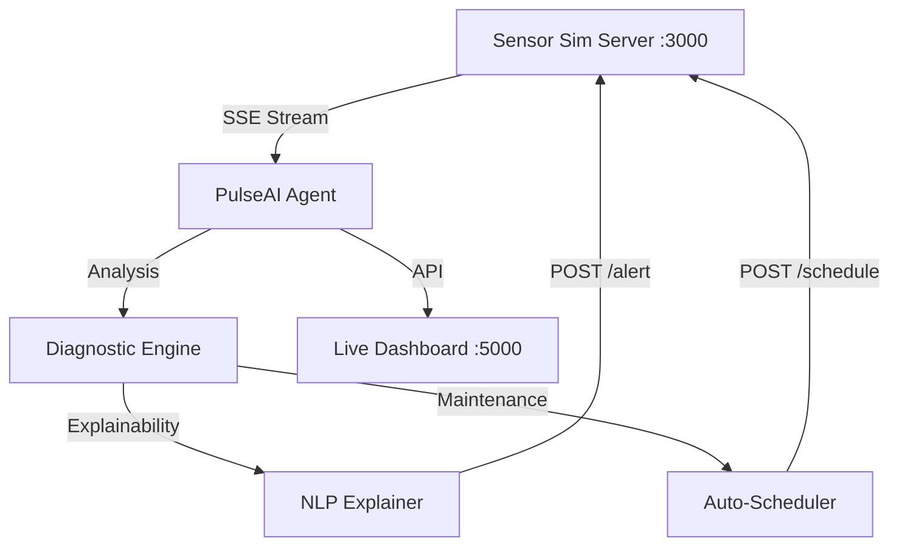

# 🦾 PulseAI — Predictive Maintenance Agent
### Team SAHASTRIX | Hack Malenadu '26

PulseAI is an advanced, autonomous industrial health monitoring system designed for the **Hack Malenadu 2026** competition. It ingest real-time sensor streams from multiple machines to predict failures, explain anomalies, and automate maintenance scheduling.

---

## 🌟 Key Features
- **📊 Adaptive Baselines**: Automatically computes normal operating ranges (7-day history) for Temperature, Vibration, RPM, and Current for every machine.
- **🕒 Real-Time Predictive Analysis**: Processes 4 parallel sensor streams simultaneously with <800ms latency.
- **🧬 Compound Failure Detection**: Identifies multi-sensor signatures (e.g., Bearings vs. Motor Overloads) to provide high-fidelity diagnostics.
- **🌍 Systemic Correlation**: Detects if multiple machines are failing together, indicating facility-wide power or cooling issues.
- **🗣️ Explainable AI**: Converts complex sensor math into human-readable engineering reports.
- **📅 Autonomous Scheduling**: Automatically books maintenance slots with the central server for high-risk equipment.
- **📈 Live Dashboard**: A custom-built, premium monitoring interface for real-time visualization of machine health and deviation heatmaps.

---

## 🗺️ System Architecture



---

## 🚀 Getting Started

### 1. Prerequisites
- **Node.js** (v16+) — To run the simulation server.
- **Python** (v3.10+) — To run the agent.

### 2. Setup
Clone the repository and install dependencies:

```bash
# Install Simulation Server dependencies
cd 'Malenadu Hackathon'
npm install

# Install Agent dependencies
cd ../pulseai
pip install flask flask-cors requests sseclient-py
```

### 3. Running the System
You need to run both the **Simulation Server** and the **PulseAI Agent**.

#### Step A: Start Simulation Server
In one terminal:
```bash
cd 'Malenadu Hackathon'
npm start
```
*The server will generate 7 days of history and start listening on [http://localhost:3000](http://localhost:3000).*

#### Step B: Start PulseAI Agent
In a second terminal:
```bash
# From the project root
python pulseai/agent.py
```
*The agent will load the history, compute baselines, and start monitoring. The API will listen on [http://localhost:5000](http://localhost:5000).*

---

## 📊 Using the Dashboard
Once both are running, open the PulseAI Dashboard:
1.  Navigate to [http://localhost:5000](http://localhost:5000) in your browser.
2.  View live gauges for all 4 machines.
3.  Monitor the **Sensor Deviation Heatmap** to see exactly how many Standard Deviations (σ) a machine is from its normal state.
4.  Read real-time **Diagnostic Hypotheses** generated by the agent.

---

## 🛠️ Project Structure
- `pulseai/agent.py`: Main entry point & Dashboard API.
- `pulseai/detector.py`: Heuristic engine for anomaly, drift, and correlation detection.
- `pulseai/explainer.py`: Logical mapping from sensor data to maintenance recommendations.
- `pulseai/stream.py`: Multi-threaded SSE consumer.
- `pulseai/baseline.py`: Statistical history processor.
- `pulseai/dashboard/`: Frontend visualization files.
- `Malenadu Hackathon/`: The provided simulation environment.

---

## 🏆 Hackathon Compliance
- ✅ **POST /alert**: Called automatically on detection.
- ✅ **POST /schedule-maintenance**: Bonus feature implemented for High/Critical risks.
- ✅ **Processing Speed**: Constant-time O(1) analysis per reading, well under the 800ms requirement.
- ✅ **Multi-Machine**: Fully detects facility-wide systemic failures.

---
*Built with ❤️ for industrial excellence.*
